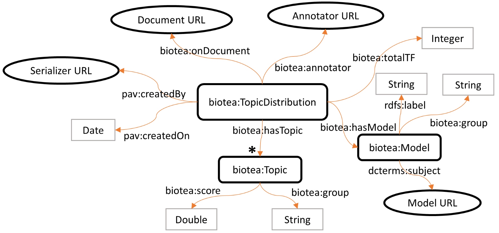

# biotea-ontololgy
An ontology to support the RDFization of scientific documents in the Biotea project. Specifically, it supports group-based distribution and semantic similarity.

**Table of Contents**

- [Background](#background)
  - [Semantic similarity](#semantic-similarity)
  - [Group-based distribution](#group-based-distribution)
  - [Semantic groups model](#semantic-groups-model)
- [Ontology at a glance](#ontology-at-a-glance)
- [Classes](#classes)
- [Object properties](#object-properties)
- [Data type properties](#data-type-properties)

## Background

### Semantic similarity 

Similarity between a query document and a related document taking into account semantic annotations identified in the text. A semantic annotation is a word or set of words associated to an ontological term. The similarity can be restricted to some particular groups defined in a model.

### Group-based distribution

Distribution of all the terms in a document according to a model describing a set of groups. Every group gets a score [0.0, 1.0] and the summation of all scores is 1.0.

### Semantic groups model
Both group-based distribution and semantic similarty refers to a model of semantic groups such as UMLS or Biolinks. Biolinks is a customization of UMLS semantic groups aiming for more granular groups. The groups consider in Biolinks are: ACTI (Activities & Behaviors), ANAT (Anatomy), CHEM (Chemical entities), CONC (Concepts & Ideas), DEVI (Devices), DISO (Disorders), DRUG (Drugs), GENE (Genes & Molecular Sequences), GEOG (Geographic Areas), GNPT (DNA & Protein molecules), OBJC (Objects), OBSV (Physiology attributes & processes), OCCU (Occupations), ORGA (Organizations), PEOP (People and population groups), PHEN (Phenomena), PHYS (Physiological functions), PROC (Procedures), SYMP (Disorder symptoms) and TAXA (Taxonomic terms).

## Ontology at a glance

Semantic similarity model

Group-based distribution model

## Classes

**Biolink**
Semantic similarity between a query document and a related document. A score [0.0, 1.0] is assigned to the similarity. The similarity can be restricted to a set of groups defined in a model (e.g. Biolinks or UMLS semantic groups). The semantic annotations participating in the similarity are also recorded (optional).

**Model**
A model of semantic groups, e.g., UMLS or Biolinks semantic groups. A set of concepts is associated to one group and only one in the model.

**SemanticAnnotation**
A portion of a document (i.e., word or sequence of words) associated to a semantic entity (e.g., CUI in UMLS).

**Topic**
A portion of a document (i.e., word or sequence of words) associated to a semantic entity (e.g., CUI in UMLS).

**TopicDistribution**
A class representing a Biolinks group-based distribution. Such a distribution is defined on a document and all Biolinks group. A score is associated to each group, representing the weight of that group in the document.

## Object properties

**annotator**
Points to the annotator used to generate the semantic annotations in a document.

**hasModel**
Points to the model used for the group-based distribution or group-narrowed semantic similarity.

**hasTopic**
Points to the group with an assigend score (i.e., topic) in a group-based distribution.

**link**
Link between a biotea:Biolink and a semantic annotation. Used to record the semantic annotations participating in the similarity between two documents.

**onDocument**
Points to the document for which the group-based distribution has been calculated.

**onQueryDocument**
Points to the query document used to calculate a semantic similarity.

**onRelatedDocument**
Points to the compared document used to calculate a semantic similarity.

## Data type properties

**group**
Name given to a semantic group in a Model. String.

**idf**
Inverse document frequency of a term in a collection of documents. Double.

**occurrences**
Legacy, see biotea:tf. 

**score**
Distribution or similarity score. Double.

**tf**
Term frequency of a term in a document. Integer.

**totalTF**
Total term frequency of all the terms used to calculate a TopicDistribution. Integer.
