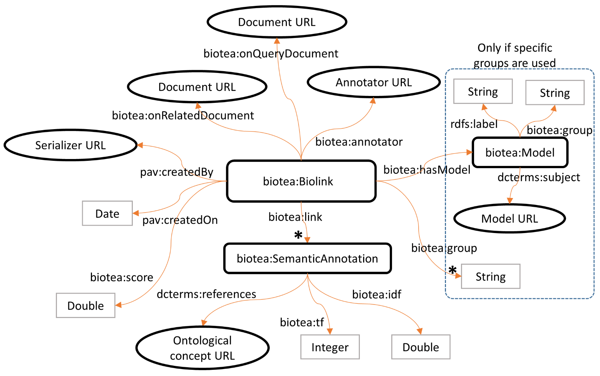

# biotea-ontololgy
An ontology to support the RDFization of scientific documents in the Biotea project. Specifically, it supports group-based distribution and semantic similarity.

**Table of Contents**

- [Background](#background)
  - [Semantic similarity](#semantic-similarity)
  - [Group-based distribution](#group-based-distribution)
  - [Semantic groups model](#semantic-groups-model)
  - [Other ontologies](#other-ontologies)
- [Ontology at a glance](#ontology-at-a-glance)
- [Classes](#classes)
- [Object properties](#object-properties)
- [Data type properties](#data-type-properties)

## Background

### Semantic similarity 

Similarity between a query document and a related document taking into account semantic annotations identified in the text. A semantic annotation is a word or set of words associated to an ontological term. The similarity can be restricted to some particular groups defined in a model.

### Group-based distribution

Distribution of all the terms in a document according to a model describing a set of groups. Every group gets a score [0.0, 1.0] and the summation of all scores is 1.0.

### Semantic groups model
Both group-based distribution and semantic similarty refers to a model of semantic groups such as UMLS or Biolinks. Biolinks is a customization of UMLS semantic groups aiming for more granular groups. The groups consider in Biolinks are: ACTI (Activities & Behaviors), ANAT (Anatomy), CHEM (Chemical entities), CONC (Concepts & Ideas), DEVI (Devices), DISO (Disorders), DRUG (Drugs), GENE (Genes & Molecular Sequences), GEOG (Geographic Areas), GNPT (DNA & Protein molecules), OBJC (Objects), OBSV (Physiology attributes & processes), OCCU (Occupations), ORGA (Organizations), PEOP (People and population groups), PHEN (Phenomena), PHYS (Physiological functions), PROC (Procedures), SYMP (Disorder symptoms) and TAXA (Taxonomic terms).

### Other ontologies
Our model references terms in the following ontologies:
* [DCTERMS](http://dublincore.org/documents/dcmi-terms/)
* [PAV](http://pav-ontology.github.io/pav/)
* [RDFS](https://www.w3.org/TR/rdf-schema/)

## Ontology at a glance

### Semantic similarity model

### Group-based distribution model

## Classes

#### Biolink
||
| :---------- |
| Semantic similarity between a query document and a related document. A score [0.0, 1.0] is assigned to the similarity. The similarity can be restricted to a set of groups defined in a model (e.g. Biolinks or UMLS semantic groups). The semantic annotations participating in the similarity are also recorded (optional). | 
|used as domain in object properties |
|[biotea:annotator](#annotator), [biotea:hasModel](#hasmodel), [biotea:link](#link), [biotea:onQueryDocument](#onquerydocument), [biotea:onrelateddocument], pav:createdBy|
|used as domain in data properties |
|[biotea:group](#group), biotea:score, pav:createdOn|

#### ElementSelector
||
| :---------- |
| Selector used in annotations to point to elements within an RDF file. In Biotea this selector is used to link an annotation to the section or paragraph where the corresponding term was identified. |
|used as domain in object properties |
|ao:onResource|
|used as range in object properties |
|ao:context|

### Model
||
| :------ |
|A model of semantic groups, e.g., UMLS or Biolinks semantic groups. A set of concepts is associated to one group and only one in the model.|
|used as domain in object properties |
|dcterms:subject|
|used as domain in data properties |
|[biotea:group](#group), rdfs:label|
|used as range in object properties |
|[biotea:hasModel](#hasmodel)|

### SemanticAnnotation
||
| :---------- |
|A portion of a document (i.e., word or sequence of words) associated to a semantic entity (e.g., CUI in UMLS).|
|used as domain in object properties |
|dcterms:references|
|used as domain in data properties |
|[biotea:idf](#idf), [biotea:tf](#tf)|
|used as range in object properties |
|[biotea:link](#link)|

### Topic
||
| :---------- |
|Group name and distribution score calculated for such a group.|
|used as domain in data properties |
|[biotea:score](#score), rdfs:label|
|used as range in object properties |
|[biotea:hasTopic](#hastopic)|

### TopicDistribution
||
| :---------- |
|A class representing a Biolinks group-based distribution. Such a distribution is defined on a document and all Biolinks group. A score is associated to each group, representing the weight of that group in the document.|
|used as domain in object properties |
|[biotea:annotator](#annotator), [biotea:hasModel](#hasmodel), [biotea:onDocument](#ondocument), [biotea:hasTopic](#hastopic), pav:createdBy|
|used as domain in data properties |
|[biotea:totalTF](#totaltf), pav:createdOn|

## Object properties

### annotator
||
| :---------- |
|Points to the annotator used to generate the semantic annotations in a document.|
|suggested domains|
|[biotea:Biolink](#biolink), [biotea:TopicDistribution](#topicdistribution)|

### hasModel
||
| :---------- |
|Points to the model used for the group-based distribution or group-narrowed semantic similarity.|
|suggested domains|
|[biotea:Biolink](#biolink), [biotea:TopicDistribution](#topicdistribution)|
|declared ranges|
|[biotea:Model](#model)|

### hasTopic
||
| :---------- |
|Points to the group with an assigend score (i.e., topic) in a group-based distribution.|
|suggested domains|
|[biotea:TopicDistribution](#topicdistribution)|
|declared ranges|
|[biotea:Topic](#topic)|

### link
||
| :---------- |
|Link between a biotea:Biolink and a semantic annotation. Used to record the semantic annotations participating in the similarity between two documents.|
|declared domains|
|[biotea:Biolink](#biolink)|
|suggested ranges|
|[biotea:SemanticAnnotation](#semanticannotation)|

### onDocument
||
| :---------- |
|Points to the document for which the group-based distribution has been calculated.|
|declared domains|
|[biotea:TopicDistribution](#topicdistribution)|

### onQueryDocument
||
| :---------- |
|Points to the query document used to calculate a semantic similarity.|
|declared domains|
|[biotea:Biolink](#biolink)|

### onRelatedDocument
||
| :---------- |
|Points to the compared document used to calculate a semantic similarity.|
|declared domains|
|[biotea:Biolink](#biolink)|

### paragraphList
||
| :---------- |
|Points to a list of paragraphs in an RDFized article.|
|suggested domains|
|doco:Section|
|suggested ranges|
|rdf:Seq|

### sectionList
||
| :---------- |
|Points to a list of sections in an RDFized article.|
|suggested domains|
|bibo:Document, doco:Section|
|suggested ranges|
|rdf:Seq|

## Data type properties

### group
||
| :---------- |
|Name given to a semantic group in a Model.|
|suggested domains|
|[biotea:Biolink](#biolink), [biotea:Model](#model), [biotea:Topic](#topic)|

### idf
||
| :---------- |
|Inverse document frequency of a term in a collection of documents.|
|suggested domains|
|[biote:SemanticAnnotation](#semanticannotation)|
|declared type|
|xsd:Double|

### occurrences
||
| :---------- |
|Legacy, see [biotea:tf](#tf) |

### score
||
| :---------- |
|Distribution or similarity score.|
|suggested domains|
|[biotea:Biolink](#biolink), [biotea:Topic](#topic)|
|declared type|
|xsd:Double|

### tf
||
| :---------- |
|Term frequency of a term in a document.|
|suggested domains|
|[biotea:SemanticAnnotation](#semanticannotation)|
|declared type|
|xsd:Integer|

### totalTF
||
| :---------- |
|Total term frequency of all the terms used to calculate a TopicDistribution.|
|suggested domains|
|[biotea:TopicDistribution](#topicdistribution)|
|declared type|
|xsd:Integer|
